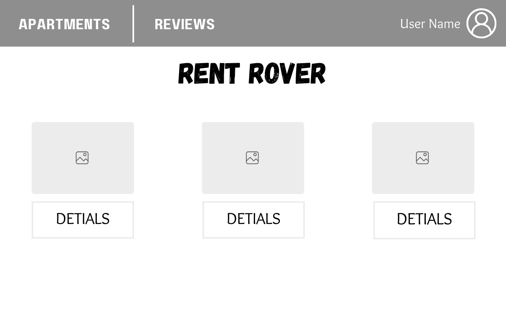
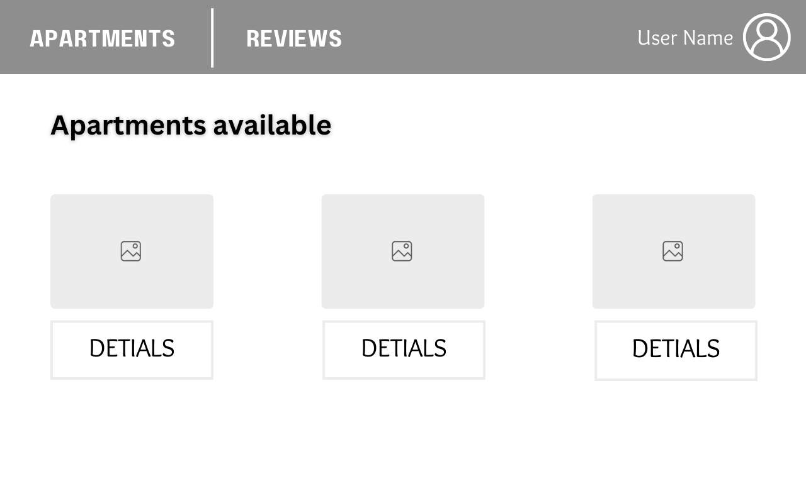
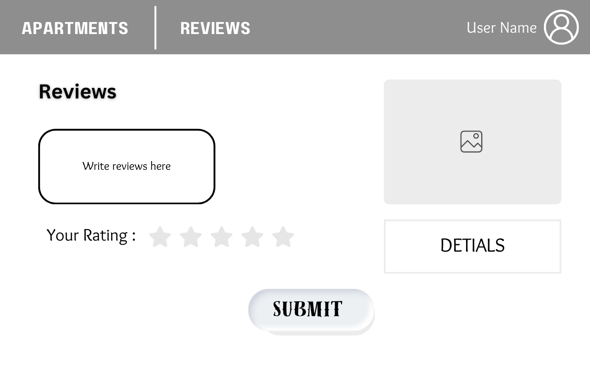

# Rent Rover

## Date: 22/5/2024

### By: Dream Team

#### Abdulla Hisham [Instagram](https://www.instagram.com/3abood23/?hl=en)| [GitHub](https://github.com/chupa1997) | [LinkedIn](www.linkedin.com/in/aboodisa)

#### Fahad Iqbal [Instagram](https://www.instagram.com/fahad.iqb?igsh=MXVrN20yZGZhNzRxMg==)| [GitHub](https://github.com/FahadIqbal1122) | [LinkedIn](https://www.linkedin.com/in/fahadiqbalmohammad?utm_source=share&utm_campaign=share_via&utm_content=profile&utm_medium=android_app)

#### Maryam Al-Mutawaa [Instagram](https://www.instagram.com/mryam_almutawa?igsh=MWJ4djhoaDUyY3I2ZQ%3D%3D&utm_source=qr)| [GitHub](https://github.com/MaryamAlmutawa9) | [LinkedIn](https://www.linkedin.com/in/maryam-almutawa-1b0767289?utm_source=share&utm_campaign=share_via&utm_content=profile&utm_medium=ios_app)

#### Afrah Mohammed [Instagram](https://www.instagram.com/_afrah_mohammed/)| [GitHub](https://github.com/Afrah) | [LinkedIn](<[www.linkedin.com/in/aboodisa](https://www.linkedin.com/in/afrah-mohd-6ab257276/)>)

---

### **Find Your Appartment App**

#### This App will be for users who are looking for appartments for rent depending on their requierments.
#### It also allows user to see appartment details such as: Fruneture, Rooms, Appartment View, Parking, Services and Price. 
#### The app can track client payments and have payment history to see who is late for rent or who paid extra and subtract it from next rent 

---

## **_Technologies used_**

### - Front-end
#### - HTML - CSS - Javascript

### - Back-end
#### - Express
#### - Frameworks: Node.js - Databases:  MongoDB - Google Authorization

---

### **_Wireframe_**

---

### **_Progress_**

#### You can see projects progress from [Trello](https://trello.com/b/DR5WLmgo/rentrover-project)

---

### **_Future Updates_**
####  subscribers will be able to display their properties to sell or rent.
---

### **_Credits_**

---
